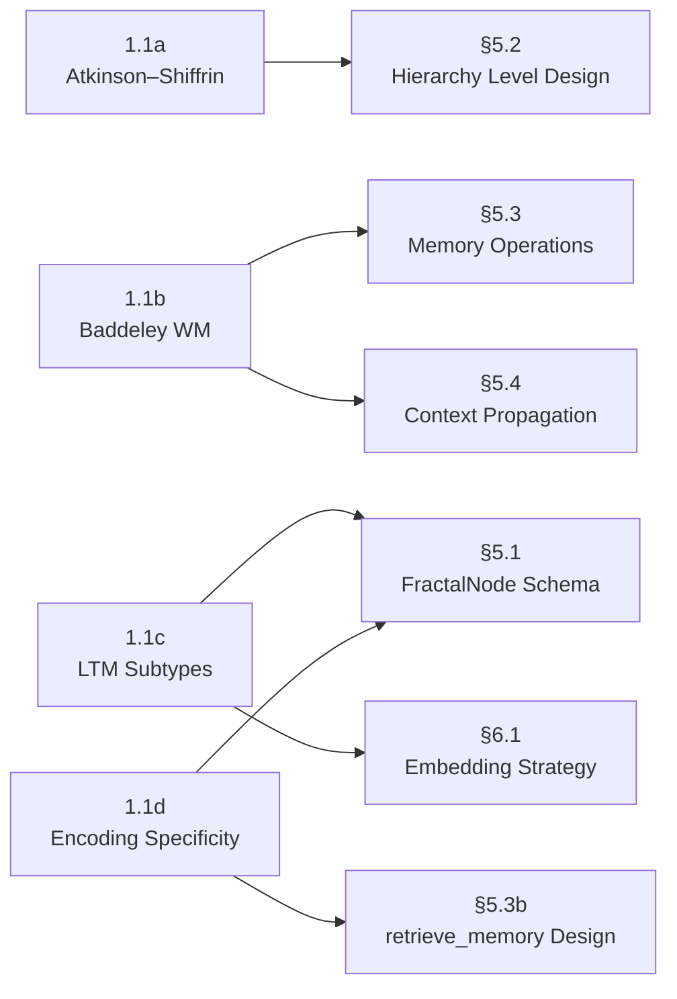

# Section 1.1 — Human Memory Architecture: Scope Breakdown

> **Parent**: [research-plan.md](file:///Users/ryan/Documents/GitHub/fractal-recall/docs/research-plan.md) § 1. Cognitive Science & Neuroscience Foundations
>
> **Purpose**: Establish the psychological and neuroscientific grounding for every tier, node schema, and retrieval mechanism in Fractal Recall. This section is _foundational_ — later sections on consolidation (1.2), predictive coding (1.3), and all of Section 5 (Core Design Theory) depend on the vocabulary and mapping tables produced here.

> [!IMPORTANT]
> **Resource constraint**: All research must use **free, publicly accessible sources only** — open textbooks, Wikipedia, lecture videos, and open-access papers. Paywalled journals are cited for academic attribution only, not as required reading.

---

## 1.1a — Atkinson–Shiffrin Multi-Store Model

### Objective

Survey the Atkinson–Shiffrin (1968) multi-store model of human memory and produce a formal mapping from each biological store (sensory register, short-term store, long-term store) to a proposed Fractal Recall processing tier.

### Scope & Boundaries

| In Scope                                                                            | Out of Scope                                                       |
| ----------------------------------------------------------------------------------- | ------------------------------------------------------------------ |
| Original 1968 model and its three stores                                            | Later revisions that blend into Baddeley's model (covered in 1.1b) |
| Information flow: encoding, maintenance rehearsal, elaborative rehearsal, retrieval | Neural substrates (covered in §1.2)                                |
| Decay and interference theories for each store                                      | Computational implementation details (covered in §5)               |
| Criticisms of the model (e.g., oversimplification of LTM as a single store)         | Multi-modal extensions (images, audio — covered in §4.3c)          |

### Limitations

- The Atkinson–Shiffrin model is widely considered an oversimplification of biological memory. We use it as a _starting scaffold_, not as ground truth.
- The model is linear (sensory → STM → LTM); Fractal Recall's tree structure is non-linear. The mapping will be approximate and must be explicitly annotated where it diverges.

### Deliverables

1. **Literature summary** (1–2 pages): Plain-language explanation of the model with key citations.
2. **Tier mapping table**: Three-column table — Biological Store | Properties (capacity, duration, encoding format) | Proposed Fractal Recall Analogue.
3. **Divergence log**: Bulleted list of where the biological model and the digital design intentionally differ, with rationale.

### Acceptance Criteria

- [ ] Summary references the Atkinson–Shiffrin model accurately and cites at least two open sources.
- [ ] Tier mapping table has an entry for every store (sensory, STM, LTM) with no empty cells.
- [ ] Divergence log contains ≥3 entries acknowledging known oversimplifications.
- [ ] A peer (or future-us) can read the deliverables and understand _why_ Fractal Recall has the tiers it has.

### Research Approach

| Step                       | Method     | Free Resources                                                                                                                                              |
| -------------------------- | ---------- | ----------------------------------------------------------------------------------------------------------------------------------------------------------- |
| Learn the model            | Wikipedia  | [Atkinson–Shiffrin memory model](https://en.wikipedia.org/wiki/Atkinson%E2%80%93Shiffrin_memory_model) — comprehensive article with diagrams and criticisms |
| Open textbook deep-read    | OpenStax   | [OpenStax Psychology 2e, Ch. 8: Memory](https://openstax.org/books/psychology-2e/pages/8-1-how-memory-functions) (free, CC-licensed)                        |
| Watch lecture explanations | YouTube    | Crash Course Psychology #13: "How We Make Memories"; MIT OCW 9.00SC Lecture 10 (Memory I)                                                                   |
| Identify criticisms        | Web search | Search "Atkinson Shiffrin model criticisms site:edu OR site:org" for university-hosted summaries                                                            |
| Draft the tier mapping     | Synthesis  | Map each store's properties against Fractal Recall's proposed Level 0–3 hierarchy                                                                           |

### Work Estimate

| Activity                       | Estimated Time  |
| ------------------------------ | --------------- |
| Reading & watching             | 1.5–2 hours     |
| Summary writing                | 1 hour          |
| Mapping table + divergence log | 1 hour          |
| **Total**                      | **3.5–4 hours** |

---

## 1.1b — Baddeley's Working Memory Model

### Objective

Study Baddeley's (1974, 2000) Working Memory model — central executive, phonological loop, visuospatial sketchpad, episodic buffer — and identify which components have viable digital analogues within a fractal memory system.

### Scope & Boundaries

| In Scope                                                | Out of Scope                                                                        |
| ------------------------------------------------------- | ----------------------------------------------------------------------------------- |
| The four components of the model and their functions    | Neural correlates of each component (covered in §1.2, §1.3)                         |
| The 2000 revision adding the episodic buffer            | Clinical studies (amnesia, aphasia) except as evidence for component independence   |
| Capacity limits and interference patterns per component | Full computational models of WM (e.g., ACT-R, Soar — noted but not deep-dived here) |
| How WM interacts with LTM (retrieval into the buffer)   | Implementation in code (§5)                                                         |

### Limitations

- Baddeley's model is primarily about _active manipulation_, not _storage_. Fractal Recall is fundamentally a storage system; the mapping is about identifying which _processing functions_ should exist alongside the storage hierarchy.
- The "central executive" is often criticized as a homunculus — a black box that explains everything and nothing. We should be honest about where the analogy breaks down.

### Deliverables

1. **Component catalog** (1–2 pages): Description of each WM component with capacity, duration, and encoding characteristics.
2. **Digital analogue matrix**: Four-column table — WM Component | Biological Function | Digital Analogue Candidate | Feasibility Rating (High / Medium / Low / None).
3. **Design implications memo**: ≤1 page of concrete recommendations, e.g., "Fractal Recall should include a transient 'active workspace' buffer analogous to the episodic buffer, separate from the persistent tree."

### Acceptance Criteria

- [ ] Catalog covers all four components (central executive, phonological loop, visuospatial sketchpad, episodic buffer).
- [ ] Analogue matrix explicitly marks at least one component as "no viable digital analogue" or explains why all are viable.
- [ ] Design implications memo contains ≥2 actionable recommendations that feed into §5.1 (FractalNode spec) or §5.3 (Memory Operations).
- [ ] Cites at least two free sources covering the model.

### Research Approach

| Step                           | Method          | Free Resources                                                                                                                                                    |
| ------------------------------ | --------------- | ----------------------------------------------------------------------------------------------------------------------------------------------------------------- |
| Learn the model                | Wikipedia       | [Baddeley's model of working memory](https://en.wikipedia.org/wiki/Baddeley%27s_model_of_working_memory) — covers all four components, includes the 2000 revision |
| Open textbook deep-read        | OpenStax        | [OpenStax Psychology 2e, Ch. 8.1](https://openstax.org/books/psychology-2e/pages/8-1-how-memory-functions) — section on working memory                            |
| Watch lecture explanations     | YouTube         | Crash Course Psychology #13; search "Baddeley working memory model explained" for university lectures                                                             |
| Survey computational WM models | Wikipedia / web | [ACT-R](https://en.wikipedia.org/wiki/ACT-R) Wikipedia article — skim for structural inspiration, working memory buffer concepts                                  |
| Draft the analogue matrix      | Synthesis       | For each component, ask: "Does Fractal Recall need this function? Can it be implemented? What would it look like?"                                                |

### Work Estimate

| Activity                              | Estimated Time  |
| ------------------------------------- | --------------- |
| Reading & watching                    | 1.5–2 hours     |
| Component catalog                     | 1 hour          |
| Analogue matrix + design implications | 1.5 hours       |
| **Total**                             | **4–4.5 hours** |

---

## 1.1c — Long-Term Memory Subtypes

### Objective

Catalog the three canonical long-term memory subtypes (episodic, semantic, procedural) and document how each should be encoded differently within a fractal node — different metadata schemas, different relationship types, different retrieval strategies.

### Scope & Boundaries

| In Scope                                                                                           | Out of Scope                                                             |
| -------------------------------------------------------------------------------------------------- | ------------------------------------------------------------------------ |
| Tulving's episodic vs. semantic distinction (1972)                                                 | Emotional/flashbulb memory (relevant but deferred to a future expansion) |
| Procedural memory (Cohen & Squire, 1980)                                                           | Implicit priming and conditioning (too granular for this phase)          |
| Encoding characteristics unique to each subtype                                                    | Consolidation mechanisms (covered in §1.2)                               |
| How each subtype maps to different Fractal Recall use cases (facts, experiences, skills/processes) | Cross-modal memory (visual, auditory LTM — covered in §4.3c)             |

### Limitations

- The episodic-semantic boundary is debated; many memories have both components. Our encoding scheme must handle hybrid nodes gracefully rather than forcing a strict taxonomy.
- Procedural memory is fundamentally about _how to do things_, which maps awkwardly to a data-storage system. We may conclude that procedural memory is better modeled as stored algorithms or workflows than as tree nodes.

### Deliverables

1. **Subtype profiles** (2–3 pages): For each subtype — definition, encoding format (verbal, spatial, motor), retrieval cues, forgetting characteristics, and real-world examples.
2. **Encoding schema proposals**: For each subtype, a draft JSON-like schema showing which `FractalNode` fields differ. E.g., episodic nodes might require `timestamp`, `location`, `emotional_valence`; semantic nodes might require `confidence`, `source_authority`, `contradiction_links`.
3. **Retrieval strategy notes**: Per-subtype notes on how retrieval should differ. E.g., episodic retrieval is cue-dependent and context-sensitive; semantic retrieval is more associative.

### Acceptance Criteria

- [ ] All three subtypes (episodic, semantic, procedural) are profiled with no missing sections.
- [ ] Encoding schemas are distinct — at least 2 fields per schema that do not appear in the others.
- [ ] Retrieval strategy notes explicitly state how level-scoped retrieval (§5.3b) behaves differently for each subtype.
- [ ] The document acknowledges the hybrid nature of many real-world memories and proposes a tagging or dual-classification approach.
- [ ] Cites at least two free sources per subtype.

### Research Approach

| Step                                    | Method          | Free Resources                                                                                                                                                                                |
| --------------------------------------- | --------------- | --------------------------------------------------------------------------------------------------------------------------------------------------------------------------------------------- |
| Learn the episodic-semantic distinction | Wikipedia       | [Episodic memory](https://en.wikipedia.org/wiki/Episodic_memory), [Semantic memory](https://en.wikipedia.org/wiki/Semantic_memory) — both thorough, well-cited                                |
| Learn procedural memory                 | Wikipedia       | [Procedural memory](https://en.wikipedia.org/wiki/Procedural_memory) — includes the Cohen & Squire distinction                                                                                |
| Open textbook deep-read                 | OpenStax        | [OpenStax Psychology 2e, Ch. 8.2: Parts of the Brain Involved with Memory](https://openstax.org/books/psychology-2e/pages/8-2-parts-of-the-brain-involved-with-memory) — LTM subtypes section |
| Survey computational memory models      | Wikipedia / web | [ACT-R](https://en.wikipedia.org/wiki/ACT-R) (declarative vs. procedural), [Soar](<https://en.wikipedia.org/wiki/Soar_(cognitive_architecture)>) — skim for how they distinguish memory types |
| Watch lecture explanations              | YouTube         | Search "episodic vs semantic vs procedural memory" — target university-produced lectures (e.g., Khan Academy, CrashCourse)                                                                    |
| Draft encoding schemas                  | Synthesis       | Prototype `FractalNode` field sets for each subtype, referencing the README's existing schema                                                                                                 |

### Work Estimate

| Activity                           | Estimated Time    |
| ---------------------------------- | ----------------- |
| Reading & watching                 | 2–3 hours         |
| Subtype profiles                   | 1.5 hours         |
| Encoding schemas + retrieval notes | 2 hours           |
| **Total**                          | **5.5–6.5 hours** |

---

## 1.1d — Tulving's Encoding Specificity Principle

### Objective

Review Tulving's encoding specificity principle (1973) and derive concrete design rules for how context metadata must be stored alongside data in a fractal node to maximize future retrievability.

### Scope & Boundaries

| In Scope                                                                                              | Out of Scope                                                                                    |
| ----------------------------------------------------------------------------------------------------- | ----------------------------------------------------------------------------------------------- |
| The encoding specificity principle and its experimental evidence                                      | Broader encoding strategies (levels-of-processing, Craik & Lockhart) — noted but not deep-dived |
| Context-dependent memory (Godden & Baddeley, 1975, underwater experiment)                             | State-dependent memory (drug/mood effects — too distant from digital analogy)                   |
| Transfer-appropriate processing (Morris et al., 1977)                                                 | Formal information-theoretic analysis of encoding (deferred to §5)                              |
| Implications for metadata design: what context must be captured at encoding time to enable retrieval? | Implementation of context capture (§5.1c, §5.4)                                                 |

### Limitations

- The principle states that retrieval succeeds when the retrieval cue matches the encoding context. In a digital system, we have _perfect recall_ of stored metadata — the challenge shifts from "can we remember the context?" to "can we _match_ query context to stored context efficiently?"
- The principle is about _human_ retrieval failure; digital systems don't "forget" in the same way. The mapping is about optimizing _relevance ranking_, not preventing data loss.

### Deliverables

1. **Principle summary** (1 page): Plain-language explanation with the classic experimental evidence.
2. **Design rules document** (1–2 pages): A numbered list of concrete rules derived from the principle, e.g.:
   - _Rule 1_: Every `FractalNode` must capture the circumstances of its creation (who, when, where, why, how).
   - _Rule 2_: Retrieval queries should include context parameters, not just content keywords.
   - _Rule 3_: The system should attempt to reconstruct encoding context when generating retrieval cues.
3. **Metadata field recommendations**: A table of recommended metadata fields directly motivated by encoding specificity, each with a justification column citing the principle.

### Acceptance Criteria

- [ ] Summary accurately describes the encoding specificity principle and cites at least two free sources.
- [ ] Design rules document contains ≥5 numbered rules, each with a one-sentence justification traceable to the principle.
- [ ] Metadata field recommendations include at minimum: `created_at`, `created_by`, `source_context`, `encoding_cues`, `retrieval_hint`.
- [ ] Document explicitly addresses the asymmetry between human forgetting and digital storage, explaining how the principle's value shifts from "preventing loss" to "improving relevance."

### Research Approach

| Step                                  | Method          | Free Resources                                                                                                                                                 |
| ------------------------------------- | --------------- | -------------------------------------------------------------------------------------------------------------------------------------------------------------- |
| Learn the principle                   | Wikipedia       | [Encoding specificity principle](https://en.wikipedia.org/wiki/Encoding_specificity_principle) — covers the core theory and classic experiments                |
| Study context-dependent memory        | Wikipedia       | [Context-dependent memory](https://en.wikipedia.org/wiki/Context-dependent_memory) — includes the Godden & Baddeley underwater study                           |
| Open textbook treatment               | OpenStax        | [OpenStax Psychology 2e, Ch. 8.3: Problems with Memory](https://openstax.org/books/psychology-2e/pages/8-3-problems-with-memory) — encoding/retrieval failures |
| Watch lecture explanations            | YouTube         | Search "encoding specificity principle explained" — target university lectures or CrashCourse                                                                  |
| Study transfer-appropriate processing | Wikipedia / web | [Transfer-appropriate processing](https://en.wikipedia.org/wiki/Transfer-appropriate_processing) — brief article, supplement with .edu sources                 |
| Derive design rules                   | Synthesis       | For each finding, ask: "What design constraint does this impose on Fractal Recall's metadata schema and retrieval API?"                                        |

### Work Estimate

| Activity                                | Estimated Time  |
| --------------------------------------- | --------------- |
| Reading & watching                      | 1.5–2 hours     |
| Principle summary                       | 0.5 hours       |
| Design rules + metadata recommendations | 1.5 hours       |
| **Total**                               | **3.5–4 hours** |

---

## Aggregate Summary

| Sub-Part | Focus                                         | Key Output                                    | Est. Hours        |
| -------- | --------------------------------------------- | --------------------------------------------- | ----------------- |
| **1.1a** | Atkinson–Shiffrin multi-store model           | Tier mapping table                            | 3.5–4             |
| **1.1b** | Baddeley's Working Memory                     | Digital analogue matrix + design implications | 4–4.5             |
| **1.1c** | LTM subtypes (episodic, semantic, procedural) | Per-subtype encoding schemas                  | 5.5–6.5           |
| **1.1d** | Tulving's encoding specificity                | Metadata design rules                         | 3.5–4             |
|          |                                               | **Total for Section 1.1**                     | **16.5–19 hours** |

### Cross-Cutting Dependencies

### Shared Resource List (All Free)

| Resource                     | Type                          | URL                                                                                                 | Used By                                        |
| ---------------------------- | ----------------------------- | --------------------------------------------------------------------------------------------------- | ---------------------------------------------- |
| OpenStax _Psychology 2e_     | Open textbook (CC-BY 4.0)     | [openstax.org](https://openstax.org/details/books/psychology-2e)                                    | 1.1a, 1.1b, 1.1c, 1.1d                         |
| Wikipedia — Memory articles  | Encyclopedia                  | Various (linked per sub-part)                                                                       | All sub-parts                                  |
| Crash Course Psychology      | YouTube series                | [youtube.com/CrashCourse](https://www.youtube.com/playlist?list=PL8dPuuaLjXtOPRKzVLY0jJY-uHOH9KVU6) | 1.1a, 1.1b                                     |
| MIT OCW 9.00SC (Intro Psych) | University lectures           | [ocw.mit.edu](https://ocw.mit.edu/courses/9-00sc-introduction-to-psychology-fall-2011/)             | 1.1a, 1.1c                                     |
| Google Scholar               | Search (for open-access PDFs) | [scholar.google.com](https://scholar.google.com)                                                    | Supplemental for all                           |
| Fractal Recall README.md     | Project context               | Local repo                                                                                          | 1.1a (tier mapping), 1.1c (schema prototyping) |

> [!NOTE]
> Original journal papers (Atkinson & Shiffrin 1968, Baddeley 1974/2000, Tulving 1972/1973, etc.) are cited for **academic attribution** in our deliverables. The actual research is conducted through the free resources above — which cover these foundational models comprehensively, since they're core introductory psychology curriculum.
